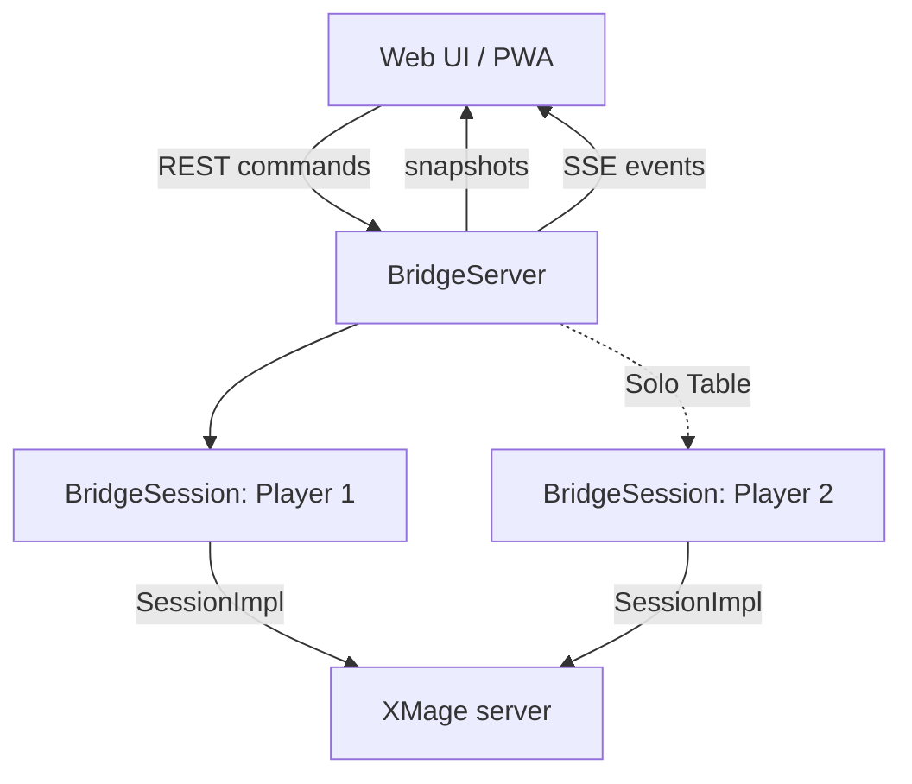
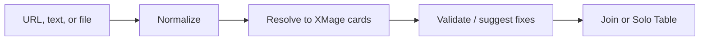
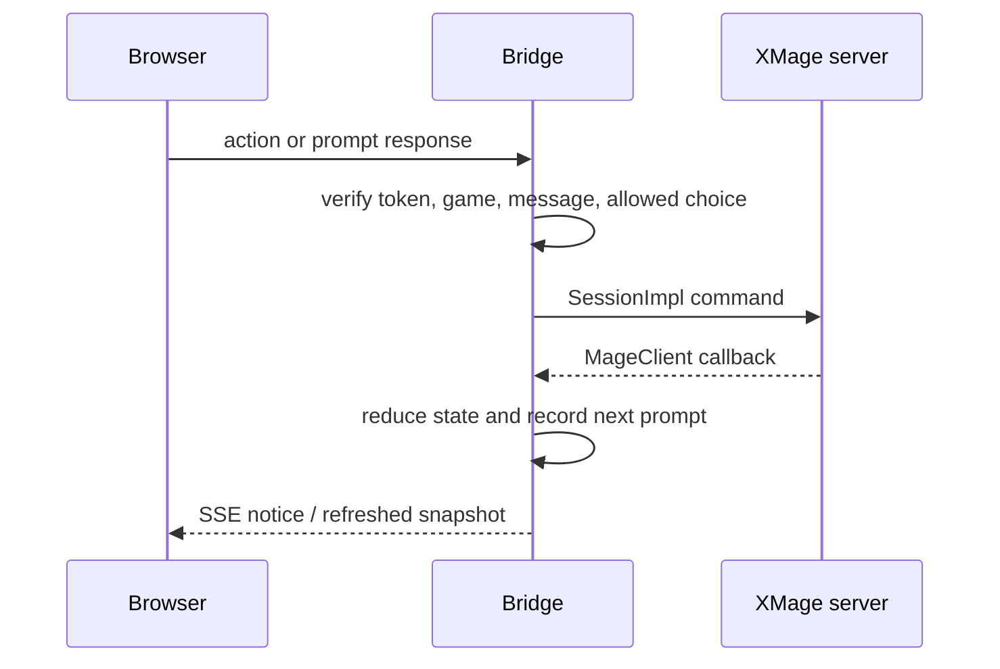

# Web bridge architecture

## Design goals

1. Keep existing XMage servers and desktop opponents unchanged.
2. Preserve XMage's server-authoritative rules and hidden-information model.
3. Translate the desktop protocol into a compact browser API suitable for touch devices.
4. Avoid bundling the full card-image library.
5. Keep the prototype deployable as one small Java container.

## Runtime topology

Normal online play uses Player 1 only. Solo Table temporarily creates Player 2, asks XMage to create a private unrated two-player match, joins both decks, and lets the browser choose which session is the active perspective.

## Boundaries and responsibilities

### Browser

The static application handles responsive layout, deck-library persistence, user intent, legal-choice highlighting, card previews, installability, and presentation of connection/game status. It sends stable IDs returned by the bridge; it does not infer whether a move is legal.

### HTTP bridge

`BridgeServer` authenticates API calls, limits request size, serves the PWA, owns the event broker, and routes each command to the correct XMage session. It also combines both session snapshots for Solo Table so the UI can state exactly which player is awaiting a response.

### XMage adapter

`BridgeSession` implements `MageClient` and wraps the version-matched `SessionImpl`. It receives XMage callbacks, tracks the latest message ID, prompt method, allowed UUID/string choices, game ID, player ID, sideboard state, and table membership.

Responses always include the current callback message ID. Stale UI responses are rejected locally instead of being sent to a newer XMage prompt.

### State reduction

`GameStateReducer` turns `GameView` and related desktop view objects into JSON-ready maps. The reduced model includes only data the connected XMage player is permitted to receive: players, battlefield, hand, stack, zones, combat indicators, priority/turn context, and available actions.

### Deck pipeline

Provider adapters produce normalized deck text. `DeckTextResolver` handles XMage-specific name and set resolution, including common double-faced-card imports. The server performs final legality checks when a table is joined.

### Images

The repository ships app icons but no Magic card-image archive. The browser resolves visible card names against Scryfall and loads images on demand. This keeps the Git repository and Render image small, but previews require network access and are subject to Scryfall availability and usage policies.

## Command and callback flow

XMage callbacks are authoritative. Generic technical callback names may be recorded for troubleshooting, while player-facing status comes from the reduced game and prompt state.

## Persistence and failure behavior

- Browser deck data and remembered bridge settings live in local storage.
- The Java process keeps XMage sessions and current game state in memory.
- Render restarts, free-tier sleeping, or container replacement end active sessions.
- There is no shared database, account system, or resumable server-side user profile.
- Reconnection support depends on XMage session behavior and remains an area for compatibility testing.

## Scaling boundary

The current singleton `BridgeServer` is intentionally single-tenant. A production shared service needs per-user session isolation, authentication beyond a shared token, lifecycle quotas, rate limits, and careful resource accounting. Until then, separate deployments are the isolation boundary.
