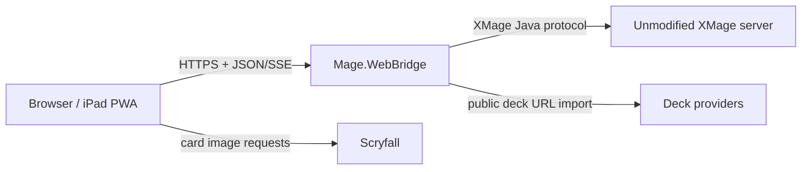

# XMage for iPad

XMage for iPad is an experimental, touch-friendly web client for XMage. It lets Safari or another modern browser use an ordinary XMage server while the server continues to enforce rules and hidden information.

The current hosted compatibility build is [xmage-ipad-bridge.onrender.com](https://xmage-ipad-bridge.onrender.com). Access requires the deployment's private bridge token.

> [!WARNING]
> This is an early compatibility build, not a replacement for every desktop-client workflow. Expect incomplete card interactions and reconnect edge cases while protocol coverage expands.

## What works

- Connect to a normal XMage server; the form shows `beta.xmage.today:17171` as the default option.
- Browse open tables and join supported constructed games with an imported deck.
- Import decklists by pasted text or file, directly from public Archidekt and MTGTop8 URLs, and through a guided Moxfield export fallback when Moxfield blocks automated retrieval.
- Store, search, copy, edit, select, and validate decks in the browser.
- Normalize common imported-card issues, including double-faced card names, before XMage validation.
- Play through a touch-oriented game screen with a prominent current-response banner, legal action badges, prompts, stack, zones, combat, mana, counters, sideboarding, concede, and match-end notices.
- Preview card images in real time from Scryfall; card images are not bundled in this repository or container.
- Start a private, unrated **Solo Table** with two ordinary human XMage seats and switch between Player 1 and Player 2.
- Install the site from Safari using **Share → Add to Home Screen**.

## How it fits together



The browser never connects to XMage's Java/RMI-style protocol directly. `BridgeServer` exposes a small HTTP API, and `BridgeSession` uses XMage's version-matched `SessionImpl` just like a native client. XMage remains authoritative for legal actions, targeting, game state, and hidden information.

For the detailed component map and request flows, see [ARCHITECTURE.md](ARCHITECTURE.md).

## Repository structure

| Path | Responsibility |
| --- | --- |
| `BridgeServer.java` | HTTP routes, bearer-token protection, static files, event stream, primary session, and Solo Table coordination |
| `BridgeSession.java` | Version-matched XMage session, callbacks, table/game commands, prompts, sideboarding, and snapshots |
| `GameStateReducer.java` | Converts desktop-oriented `GameView` objects into browser-safe game state |
| `DeckImportService.java` and provider adapters | Imports public Archidekt, Moxfield, and MTGTop8 deck URLs |
| `DeckTextResolver.java` | Resolves imported names/sets to XMage card records and prepares decks |
| `SideboardDeckBuilder.java` | Rebuilds submitted main deck and sideboard selections |
| `EventBroker.java` | Server-sent event delivery to the browser |
| `src/main/resources/web/` | HTML, CSS, JavaScript, manifest, service worker, and app icons |
| `Dockerfile`, `compose.yaml`, `docker-entrypoint.sh` | Container build and local execution |
| repository-root `render.yaml` | Free-tier Render Blueprint |
| `src/test/` and `scripts/web-bridge-probes.sh` | Unit and HTTP smoke tests |

## Build and run locally

Prerequisites are the same Java/Maven toolchain required by this XMage checkout, plus Docker if using the container workflow.

```sh
mvn -DskipTests -pl Mage.WebBridge -am install
mvn -pl Mage.WebBridge test
```

Run with Docker:

```sh
export XMAGE_BRIDGE_TOKEN="replace-this-with-a-long-random-secret"
docker compose -f Mage.WebBridge/compose.yaml up --build
```

Then open [http://localhost:8080](http://localhost:8080). For direct loopback-only development, the Java main class is `mage.webbridge.BridgeServer`; non-loopback listening requires `XMAGE_BRIDGE_TOKEN`.

See [DEPLOYMENT.md](DEPLOYMENT.md) for Render and HTTPS instructions.

## HTTP surface

All endpoints except health and static assets require the bridge bearer token.

| Endpoint | Purpose |
| --- | --- |
| `GET /api/health` | Process health |
| `POST /api/session/connect` | Connect the primary player to XMage |
| `GET/DELETE /api/session` | Read state or disconnect all sessions |
| `GET /api/events` | Live server-sent events |
| `POST /api/decks/import-url` | Import a supported public deck URL |
| `POST /api/decks/validate` | Resolve a deck against the bridge's XMage card database |
| `POST /api/tables/join` and `/leave` | Join or leave a normal table |
| `POST /api/self-play/start` | Create and join a private two-human Solo Table |
| `POST /api/self-play/perspective` | Switch the active Solo Table viewpoint |
| `GET /api/game` | Current browser-safe game snapshot |
| `POST /api/game/respond` | Answer a current XMage prompt |
| `POST /api/game/action` | Send a player action such as pass, concede, or rollback |
| `GET /api/sideboard` and `POST /api/sideboard/submit` | Read and submit sideboarding state |

## Security and sharing

- Keep `XMAGE_BRIDGE_TOKEN` secret. It controls the XMage session represented by the bridge.
- Decks and remembered connection fields are stored in that browser's local storage; card art is requested from Scryfall by the browser.
- The present process is **single-tenant**: one primary session, plus an optional second session during Solo Table. Sharing the URL and token does not create independent accounts or isolated sessions.
- For friends to use the app independently or concurrently, deploy separate bridge instances until multi-user isolation is implemented.
- Use HTTPS in production and allow outbound TCP access to the target XMage port, normally `17171`.

## Known limitations

- XMage client and server versions must match. Rebuild the bridge when the target server upgrades.
- Not every XMage callback or card-specific interaction has been exercised in the web UI.
- Drafting, sealed deck construction, tournament creation, and general table creation are not available in the browser. Solo Table is the one supported table-creation path.
- Solo Table is self-play, not AI: it occupies two ordinary player seats, requires two distinct usernames, and exposes both hands as viewpoints are switched.
- Public XMage servers may reject joins because of ratings, passwords, table state, or format/deck legality.
- A free Render instance can sleep or restart, which disconnects active games and may make first load slow.
- The app is not offline-capable; the PWA shell can install, but play requires the bridge, an XMage server, and network access.
- Provider sites can change their public export behavior. URL import therefore needs maintenance, especially Moxfield fallbacks.

See [CHANGELOG.md](CHANGELOG.md) for the web-client history. Upstream XMage documentation, licensing, and credits remain at the repository root.
